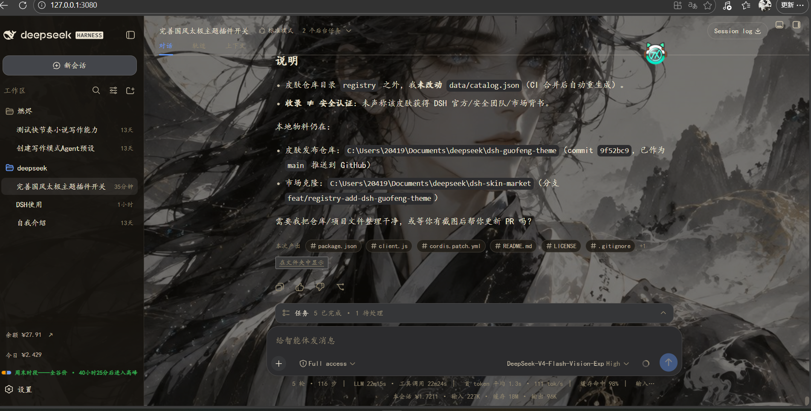

# dsh-guofeng-theme

国风太极主题（DSH Web 皮肤）：太极道君背景图 + 黛青强调色 + 楷体界面，明/暗双模式。



## 特性

- **背景**：太极道君背景图（原图压缩版），配宣纸 / 墨色两种罩色。
- **强调色**：黛青（`#3a6079` 亮色 / `#82a9c5` 暗色）。
- **字体**：楷体优先（KaiTi · STKaiti · 楷体 · Noto Serif CJK），兜底系统衬线。
- **面板**：半透明面板，背景透出；亮/暗两套参数随 `body[data-ds-dark-theme]` 自动切换。
- **滚动条/边框/文字**：墨褐配色，随明暗模式切换。

所有覆盖均通过覆盖 DSH 的 `--dsw-*` 设计令牌实现（`!important` 压过基础样式表），停用插件即完整还原官方外观。

## 安装

```sh
# GitHub 安装（固定到发布 commit）
dsh plugin --profile web add github:0watcher0/dsh-guofeng-theme#<commit-sha>

# 本地开发（link 安装，编辑即生效）
dsh plugin --profile web add <本仓库路径>
```

重启 `dsh web` 生效。

## 兼容性

- **DSH Web：`>=0.1.0-rc.6`** —— 面向 DSH Web `0.1.0-rc.6` 客户端 API（`ctx.effect` / 宿主路由 / `dsh.client` 零构建 loader 格式）开发，web profile 实机可用。
- **平台**：web（宿主半注册静态路由提供背景图与样式表；浏览器半注入样式表链接）。

## 卸载

```sh
dsh plugin --profile web remove dsh-guofeng-theme
```

## 结构

```
index.js          宿主半：注册 /guofeng/guofeng.css 与 /guofeng/taiji.jpg 路由
client.js         浏览器半：在 <head> 注入样式表链接（幂等）
assets/guofeng.css  国风样式：背景/强调色/楷体/半透明面板/明暗双模式
assets/taiji.jpg    压缩后的背景图（原图在 OneDrive，未随仓库分发）
cordis.patch.yml  bundle 声明（row id: dsh-guofeng-theme）
docs/previews/    真实界面预览图
```

## License

[MIT](./LICENSE) © 0watcher0
